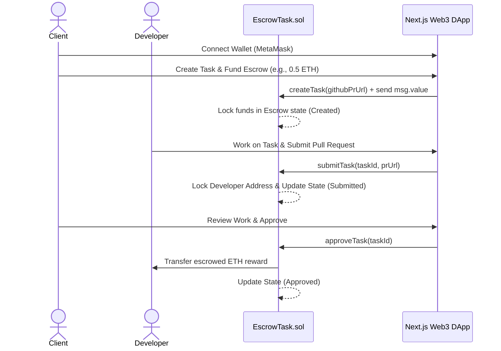

# DeFi Task Escrow & Verification Protocol (DecentraTask)

A decentralized task coordination and escrow payment protocol designed for Web3 project managers (Clients) and freelance developers (Developers). This application allows clients to list software development tasks, deposit ETH rewards into a secure smart contract escrow, and automatically distribute rewards to developers upon verified task completion.

---

## 🏗️ System Architecture



---

## ⚡ Key Features

*   **Secure Escrow Payments**: Contract acts as an escrow agent, locking client funds upon task creation and only releasing them to developers after client review.
*   **Role-Based Access Control**: Prevents clients from completing their own tasks, blocks unauthorized developers from overriding existing submissions, and limits approvals/cancellations strictly to the task client.
*   **White-Box Hardened Security**:
    *   **Reentrancy Protection**: Strictly uses the **Checks-Effects-Interactions** pattern to block reentrancy exploits.
    *   **DoS Attack Resistance**: Safe external ETH transfers utilizing low-level `.call` with strict check conditions to prevent gas block exhaustion.
*   **Modern Web3 Frontend**: Built in Next.js (App Router) featuring a glassmorphism dashboard, MetaMask wallet connection, real-time status tracking, account balance lookups, and forms for task creation and PR submission.
*   **Comprehensive Testing Suite**:
    *   **33 Hardhat Unit Tests**: Verifying deployment state, error handling, boundaries, and adversarial conditions (reentrancy, DoS).
    *   **23 E2E Integration Tests**: Testing the entire lifecycle from wallet initialization to payout settling.

---

## 🛠️ Technology Stack

*   **Backend & Blockchain**: Solidity `^0.8.20`, Hardhat, Ethers.js
*   **Frontend DApp**: Next.js 14, React 18, TypeScript, Tailwind CSS, Lucide Icons
*   **Testing Frameworks**: Mocha, Chai

---

## 🚀 How to Run Locally

### 1. Smart Contract Setup & Compilation
Navigate to the contract directory, install dependencies, and compile:
```bash
cd defitask_project
npm install
npx hardhat compile
```

### 2. Start Local Blockchain Network
Start a local Hardhat development node (starts 20 mock accounts with 10,000 ETH each):
```bash
npx hardhat node
```

### 3. Deploy the Smart Contract
Deploy the contract to your running local node:
```bash
npx hardhat run scripts/deploy.js --network localhost
```
*Note the deployed contract address (typically `0x5FbDB2315678afecb367f032d93F642f64180aa3`).*

### 4. Running the Tests
To run the Hardhat unit tests:
```bash
npx hardhat test
```
To run the opaque-box E2E test suite:
```bash
node e2e/run_e2e.js
```

### 5. Web Frontend Setup
Navigate to the frontend folder, install dependencies, and start the development server:
```bash
cd ../frontend
npm install
npm run dev
```
Open **[http://localhost:3000](http://localhost:3000)** in your browser. 

---

## 🦊 MetaMask Configuration for Testing
To interact with the local contract:
1. Open MetaMask and add a custom network:
   *   **RPC URL**: `http://127.0.0.1:8545`
   *   **Chain ID**: `31337`
   *   **Currency Symbol**: `ETH`
2. Import one of the private keys generated by `npx hardhat node` (e.g. Account #0: `0xac0974bec39a17e36ba4a6b4d238ff944bacb478cbed5efcae784d7bf4f2ff80`) to get 10,000 mock ETH.
3. Switch MetaMask to the **Hardhat Localhost** network and start testing.
