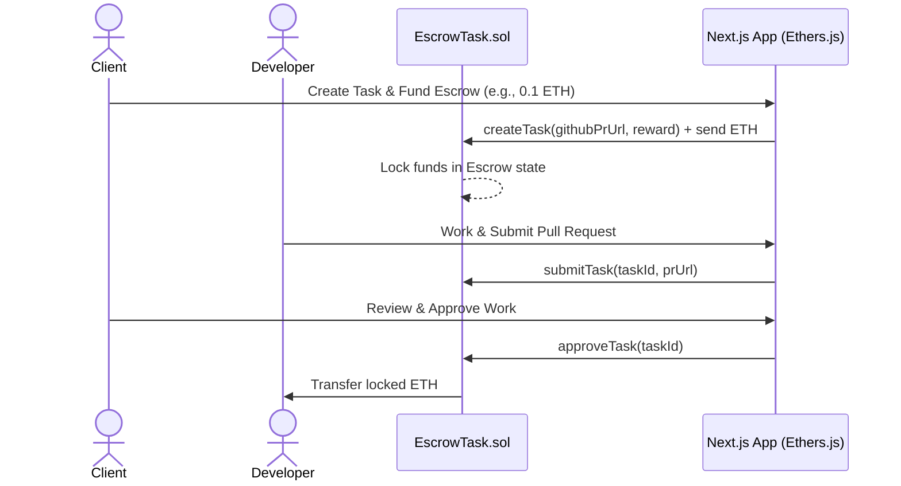

# DeFi Task Escrow & Verification Protocol

This project is a decentralized task coordination and escrow payment protocol designed for Web3 project managers and freelance developers. It allows clients to list developer tasks, deposit USDC/ETH into a smart contract escrow, and automatically distribute rewards to developers upon verified task completion.

---

## 🏗️ System Architecture



---

## 📁 Directory Structure

*   `contracts/EscrowTask.sol`: The core Solidity smart contract managing task creation, funds escrow, submission, and payout resolution.
*   `scripts/deploy.js`: A deployment script using Hardhat to deploy the contract to a local testnet or Ethereum testnets (Sepolia).
*   `frontend/`: Frontend React/Next.js files (which you can design mockups for in Google Stitch, and then wire up to this contract).

---

## 🚀 How to Run Locally

### 1. Smart Contract Setup
Ensure you have Node.js installed, then initialize Hardhat:
```bash
npm init -y
npm install --save-dev hardhat @nomicfoundation/hardhat-toolbox
npx hardhat init
```
Choose **"Create an empty hardhat.config.js"** or **"Create a Javascript project"**, then move the files from this directory to your hardhat workspace.

### 2. Compile Contracts
Compile the Solidity code:
```bash
npx hardhat compile
```

### 3. Start Local Blockchain Node
Start a local development node (launches 20 mock accounts with 10,000 ETH each):
```bash
npx hardhat node
```

### 4. Deploy Contract Local
Deploy your contract to the local test node:
```bash
npx hardhat run scripts/deploy.js --network localhost
```
